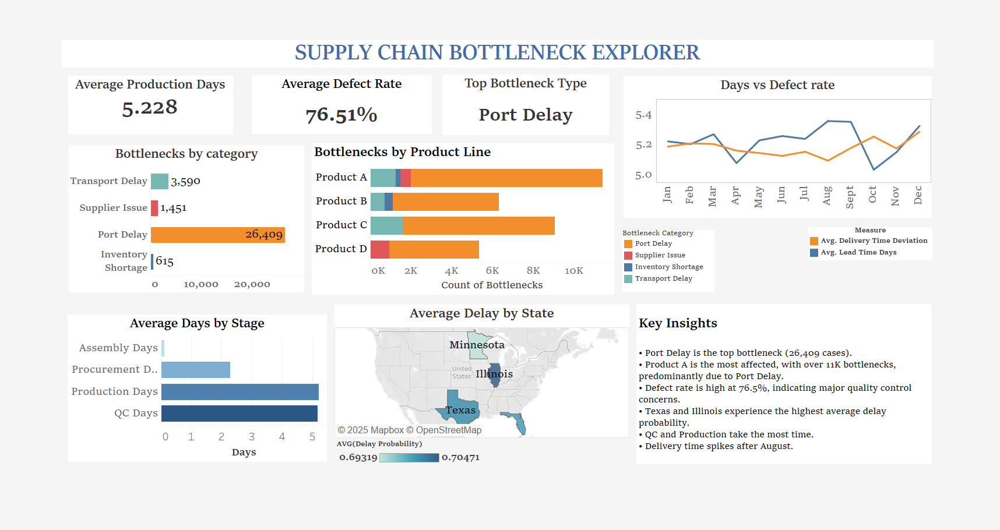

# Supply Chain Bottleneck Explorer

A dynamic Tableau dashboard designed to analyze operational bottlenecks in a manufacturing supply chain. This project identifies inefficiencies across stages like Procurement, Production, Assembly, and Quality Control using real-world logistics data.

## Dashboard Preview

🔗 **[View Interactive Dashboard on Tableau Public](https://public.tableau.com/app/profile/maria.nikitha.suresh/viz/Book1_17485785997010/Dashboard22)**

## Dashboard Overview

The dashboard provides actionable insights through:

- **Key KPIs**: Average Production Days, Defect Rate, Top Bottleneck Category
- **Trend Analysis**: Delivery Deviation vs. Lead Time over months
- **Stage-Wise Delay**: Avg. Days by Procurement, Production, Assembly, QC
- **Root Cause Breakdown**: Bottlenecks by Category and Product Line
- **Geographic Impact**: Delay Probability across U.S. states

## Key Insights

- **Port Delay** is the top cause of disruption (26K+ cases)
- **Product A** faces the most issues, especially in Production
- **Defect Rate** is alarmingly high at 76.5%
- **QC and Production** are the slowest stages
- **Texas and Illinois** experience the highest shipment delays

## 🧰 Tools Used

- **Tableau**: For visual analytics and dashboard creation  
- **Python (Pandas)**: For initial data cleaning and transformation  
- **GitHub**: Version control
- 
## 📁 Files in this Repo

| File                          | Description                                 |
|-------------------------------|---------------------------------------------|
| `SupplyChain_Dashboard.twbx`  | Tableau Packaged Workbook with dashboard    |
| `data/`                       | Preprocessed dataset used in Tableau        |
| `screenshots/`                | Dashboard and chart visuals                 |
| `README.md`                   | Project summary                             |

## Data Source

- [Logistics and Supply Chain Dataset - Kaggle](https://www.kaggle.com/datasets/datasetengineer/logistics-and-supply-chain-dataset)

## Author

**Maria Nikitha Suresh**  
[Portfolio Website](https://maria-nikitha-suresh.web.app/) • [LinkedIn](https://linkedin.com/in/maria-nikitha-588994242) • [GitHub](https://github.com/marianikitha01)

